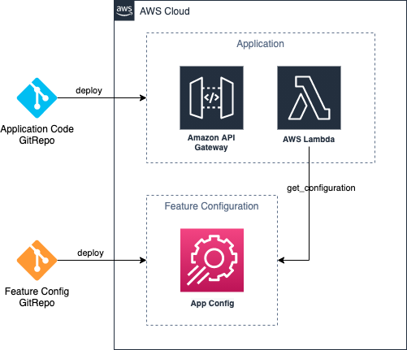

# AWS Lamda Powertools Feature Flags

In this session we will discuss what feature toggles are, when to use them, what are the best practices and how to
implement it by using AWS Lambda Powertools.

The example project contains the application we will use to showcase the feature toggle functionality and the feature
configuration repository.

## Architecture overview
How does it work?



In this example we have an application using Amazon API Gateway and AWS Lambda. 
We split between application and feature configuration by using AWS AppConfig service and store the feature configuration in [AWS AppConfig hosted configuration store](https://docs.aws.amazon.com/appconfig/latest/userguide/appconfig-creating-configuration-and-profile.html#appconfig-creating-configuration-and-profile-about-hosted-store). 
This option comes with some limitation but hat is completly free, [see docs for more details](https://docs.aws.amazon.com/appconfig/latest/userguide/appconfig-creating-configuration-and-profile.html).
There are also other options to host your configuration while using AWS AppConfig feature flags. 

This enables us to deploy code and configuration independently so that we can change functionality wihtout deploying the code. 
Be aware that this also introduce additional complexity and friction, see Best Practices section to get a better grip on challenges.

## Available Feature Flags

* Static flags: response for all requests
* Dynamic or smart flags: change flag based on specific users or tenants

### Schema

The schema document describes the features we want to use in our application. 
It has a name, a default value, and optional rules that will be evaluated. 
In this example we have two features one static `tier_feature` that will always be `true` and one dynamic `premium_feature` that is only true if the provided context during the evaluation is `{"tier": "premium"}`.
You can have multiple rules and and multiple condition, but don't overdo it too much, because it can become complicated very quickly.

For more details check the [documentation](https://awslabs.github.io/aws-lambda-powertools-python/latest/utilities/feature_flags/) of the AWS Lambda Powertools Feature Flags utility.

```json
{
  "premium_features": {
    "default": false,
    "rules": {
      "customer tier equals premium": {
        "when_match": true,
        "conditions": [
          {
            "action": "EQUALS",
            "key": "tier",
            "value": "premium"
          }
        ]
      }
    }
  },
  "tier_feature": {
    "default": true
  }
}
```

## Getting started

### Basic configuration

